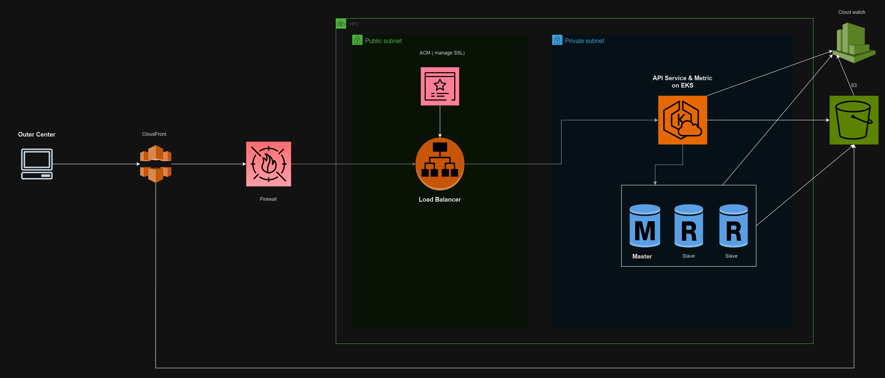

# Overview

# Description
1. Use Amazon Virtual Private Cloud (VPC) to isolate internal and external components.
Place the DB and Metrics containers in a private subnet with no direct internet access.
API containers also should be in a private subnet while LoadBalancer will be in public subnet and facing with the internet.
2. I chose to use S3 to serve UI ( statics file ) because they has features to replication files with multi-zone( easy to scale & high avaibility ) & versioning file ( control UI version ). CloudFront can be use to improves read performance and prevent from DDoS attack.
3. Firewall was used to prevent server from common attack ( SQL Injection, XSS, ...).
4. ACM has responsibility to manage SSL certificates such as automatic renewal or notification when the certificate expires.
5. CloudWatch will collect logs to aggreate the metrics. Metrics can be CPU/RAM/Disk Usage, Network Throughput, Requests per Second or service health.
6. Deploy the containers using Amazon Elastic Kubernetes Service (EKS) to easily scale the api horizontally and update with zero-downtime.
7. I chose to use Amazon Aurora instead of running postgres directly to avoid dealing with persistent state in the k8s cluster. Aurora support PostgreSQL with high performance, and it can replicate db multi-region and also can automatic backup data to S3. Transaction logs are backed-up by RDS every 5 minutes, and retention can be up to 35 days
8. With MultiAZ, MultiRegion we have increased avaibility. To preparing for and recovering from a disaster better, our system can run a smaller version. Upon disaster, we can scale it to production load
# Potential shortcomings
- The application need to control user access
  - IAM service should be used, e.g AWS IAM
- Unexpected cost overruns may occur if resource usage is not closely monitored and managed.
  - Use AWS Budget to limit the cose, and use CostExplorer to find out which services has make impact to the budget
- Performance bottlenecks
  - Collaborate with the development team to test performance and remove the bottleneck point